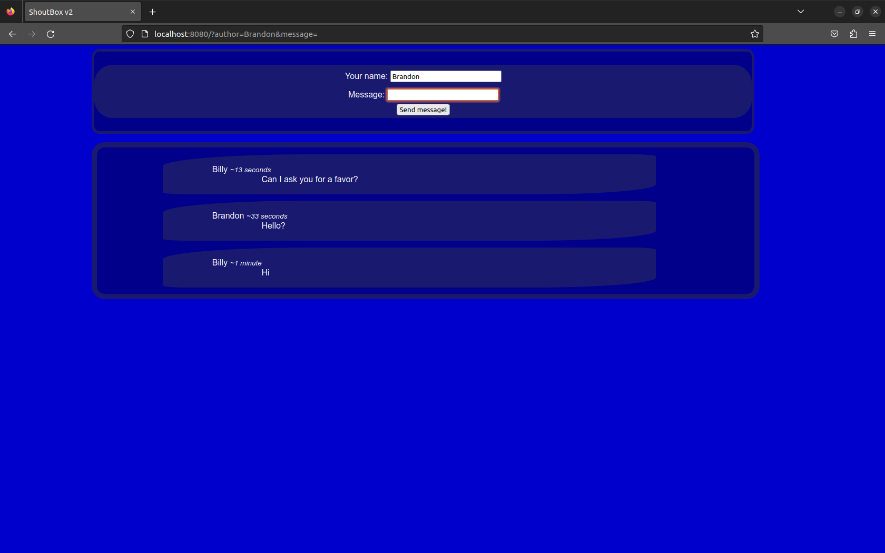
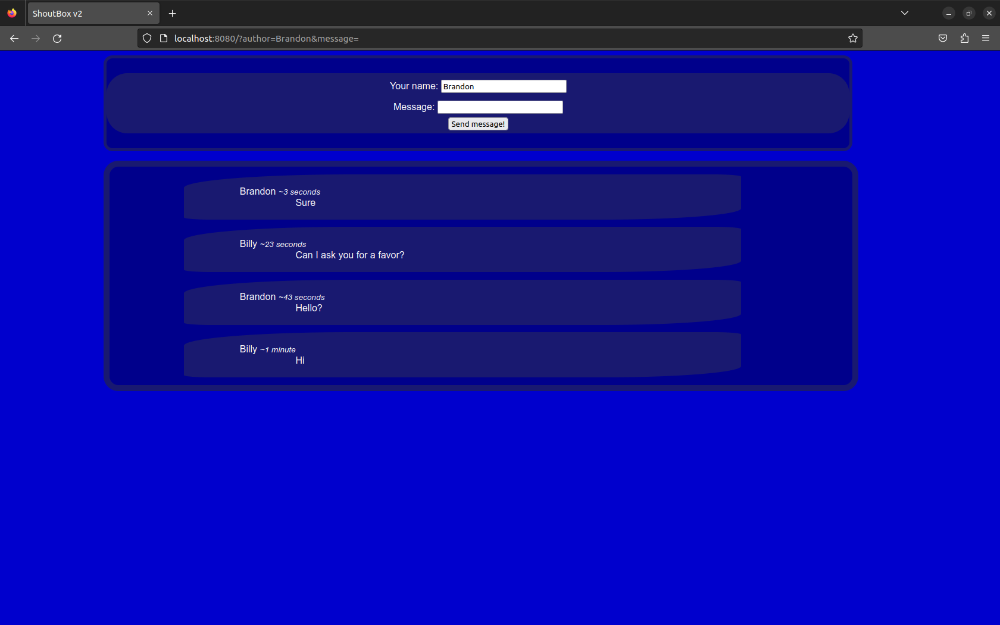

# ShoutBox v2

## What was the purpose of writing this program
A slightly modified version of the previous ShoutBox. Most of the changes are in the frontend.

## What it can do and what do you need
A simple app to send messages between several people. This version is more user-friendly. To run, open the console in the directory with the pom.xml file and enter "mvn clean install" and then "mvn spring-boot:run".

_Screen 1_ \

_Screen 2_ \

